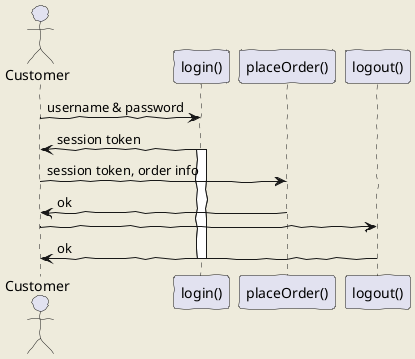

# Архитектура базы данных

## База данных для реального приложения

База данных данного приложения построена на СУБД PostgreSQL

### Данные строки подключения

- Вписать потом

## Тестирование

Тестирование данного приложения производится при помощи СУБД SQLite

### Данные строки подключения

- Вписать потом

## Таблицы, содержащиеся в базе данных

Классы-модели для данных таблиц описаны в библиотеке классов "SimpleWordModels". Пространство имен: SimpleWordModels.

### Таблица Collections

Коллекции слов (карточек). Соответвующий класс: SimpleWordModels.Collection (Collection.cs).
| Field | Type | Decription | Requied | Other restrictions |
| --- | --- | --- | -- | -- |
|Id | Primary key | Первичный ключ записи в таблице. При сооздании коллекции генерируется автоматически. | True| Неизменяем, уникален.|
| SourceLanguage | String | Язык слов и фраз, описанных в карточках коллекции.  | True | Соответвие стандарту ISO 639-3 |
| DestinationLanguage | String | Язык, на котором описаны переводы слов и фраз коллекции. | True | Соответвие стандарту ISO 639-3 |
| Name | String | Название коллекции. | True|
|Author | String | Автор коллекции. |  False |
|LinkName | String | Строка, использующаяся как get-параметр для получения информации о коллекции. Может быть сгенерировано автоматически. | True | Не более 30 символов. Может создержать только строчные латинские буквы (если в запросе содержатся заглавные, они преобразовываются в строчные), цифры и символ подчеркивания (ASCII-код 95).

### Таблица Cards

Слова и фразы, содержащиеся в коллекциях ("Карточки"). Соответвующий класс: SimpleWordModels.Card (Card.cs).
| Field | Type | Decription | Required | Other restrictions |
| --- | --- | --- | -- | -- |
| Id  | Primary key | Первичный ключ записи в таблице. При сооздании коллекции генерируется автоматически. | True| Неизменяем, уникален.|
| Word | String | Слово или фраза на исходном языке| True |
| Collection | Foreign key to collection | Коллекция, содержащая данную катрочку. | True  |

### Таблица Translations

Возможные переводы слова/фразы соответвующей карточки. SimpleWordModels.Translation (Translation.cs).

| Field | Type | Decription | Required | Other restrictions |
| --- | --- | --- | -- | -- |
| Id  | Primary key | Первичный ключ записи в таблице. При сооздании коллекции генерируется автоматически. | True| Неизменяем, уникален.|
| Card | Foreign key to word | Карточка, к которой относится перевод. | True |
| Value | String | Вариант перевода для соответвующего слова  | True |

### Таблица Examples

Образцы использования слова или фразы в определённом значении на конкретных примерах. Соответвующий класс: SimpleWordModels.Example (Example.cs).

| Field | Type | Decription | Required | Other restrictions |
| --- | --- | --- | -- | -- |
| Id  | Primary key | Первичный ключ записи в таблице. При сооздании коллекции генерируется автоматически. | True| |
| Translation | Foreign key to translation | Перевод, соответвующий образцу | True | |
| Origin | String| Пример использования слова (на исходном языке) | True 
| ExampleTranslation | String | Перевод данного примера | True |
| Comment | String | Комментарии автора коллекции к данному примеру |  False

## Отношение между таблицами

